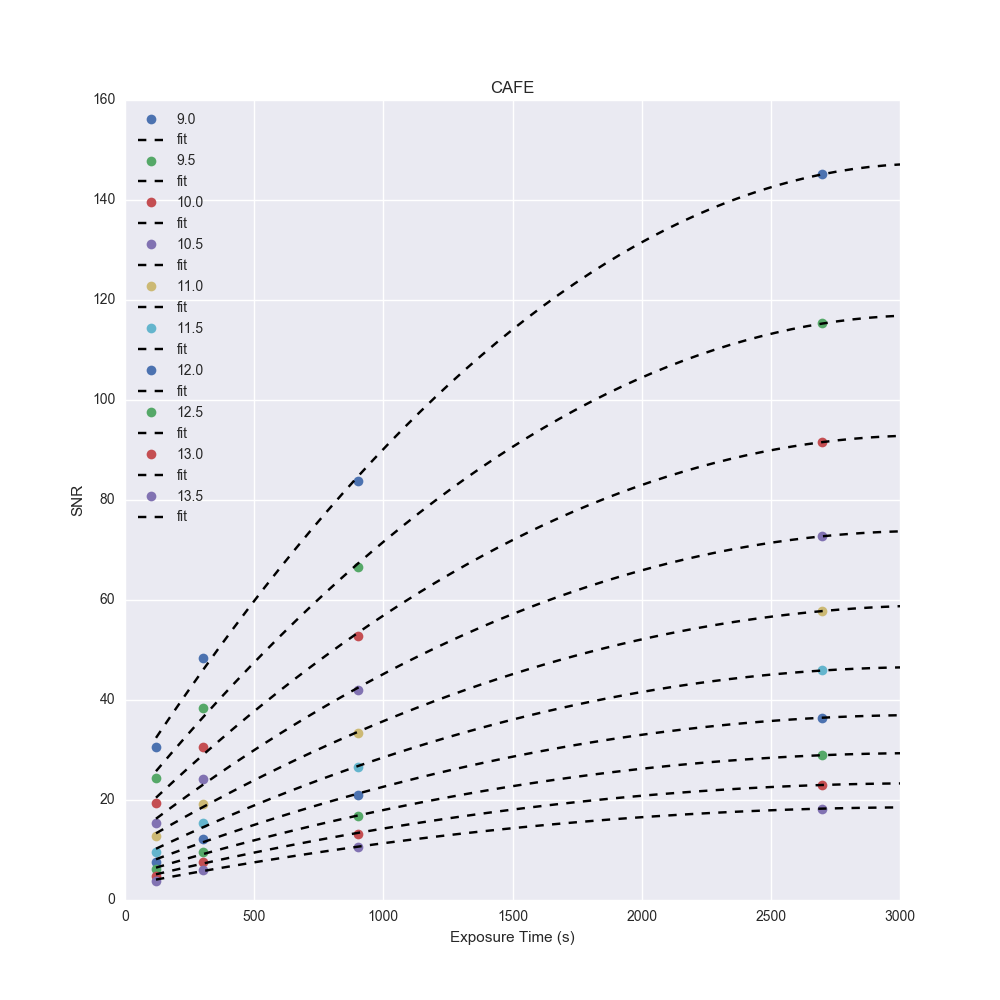

CAFE Observations Preparation
-----------------------------

Code to prepare for CAFE observations

CAFE-SNR.py estimates the required exposure times and total
observing time including overheads for obvservations with the
CAFE spectrogrpah at Calar Alto, Spain.

mkfinders.py makes 3' by 3' finding charts (N up, E left)
using pyds9 - this should be replaced with Paul's new gnerator



CAFE Data Reduction
-------------------

My ristretto.py code has been retired before completion since the release of CERES.
All reductions for CAFE should be done using CERES. See the CERES repo README for
full instructions on how to run it. Below is a quick summary of how to set things up

   1. Gather all the new CAFE in a specific location
   1. Run parseCafeHeaders.py script (with --update\_object --reffile if necessary) to set up the reffile for each night and tweak the image headers
   1. parseCafeHeaders.py can also be used to just print a summary of all the data
   1. reffile.txt should be in the raw data folder from the step above
   1. cd ~/Documents/ceres/cafe
   1. python cafepipe.py /path/to/data -npools 2

The CERES cafepipe.py script will then churn through all the data and make a series of
plots and a results.txt file. Revise all the output to confirm things are ok. Use the
housekeeping section below to then collect all the results into the database.

CERES Notes
-----------

Sometimes CERES ```cafepipe.py``` will segfault or throw a malloc error. I've traced 
this to typically come from the order identification for the last order (no. 90).
To get around this set the first instance of ```nord = 89``` in the script. **Add an 
argparse argument to address this**

CAFE Housekeeping Scripts
-------------------------

parseCafeHeaders.py - a script to check what targets have been observed

Contributors
------------

James McCormac
