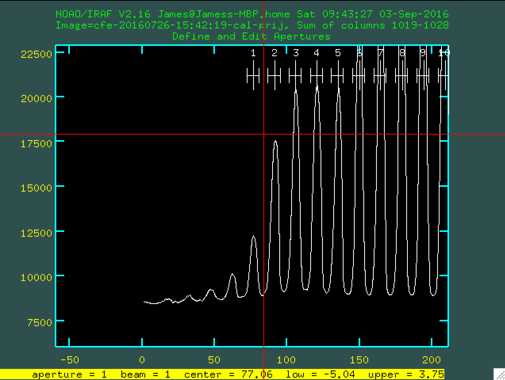
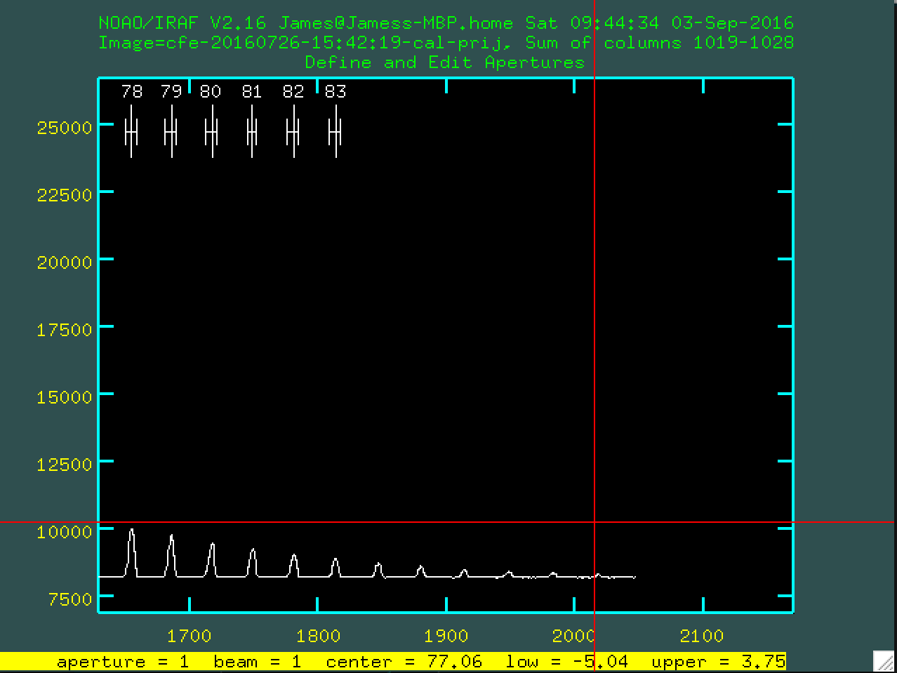

CAFE Observations Preparation
-----------------------------

Code to prepare for CAFE observations

CAFE-SNR.py estimates the required exposure times and total
observing time including overheads for obvservations with the
CAFE spectrogrpah at Calar Alto, Spain.

mkfinders.py makes 3' by 3' finding charts (N up, E left)
using pyds9 - this should be replaced with Paul's new gnerator

CAFE Data Reduction
-------------------

parseCafeHeaders.py - a script to check what targets have been observed

Contributors
------------

James McCormac
