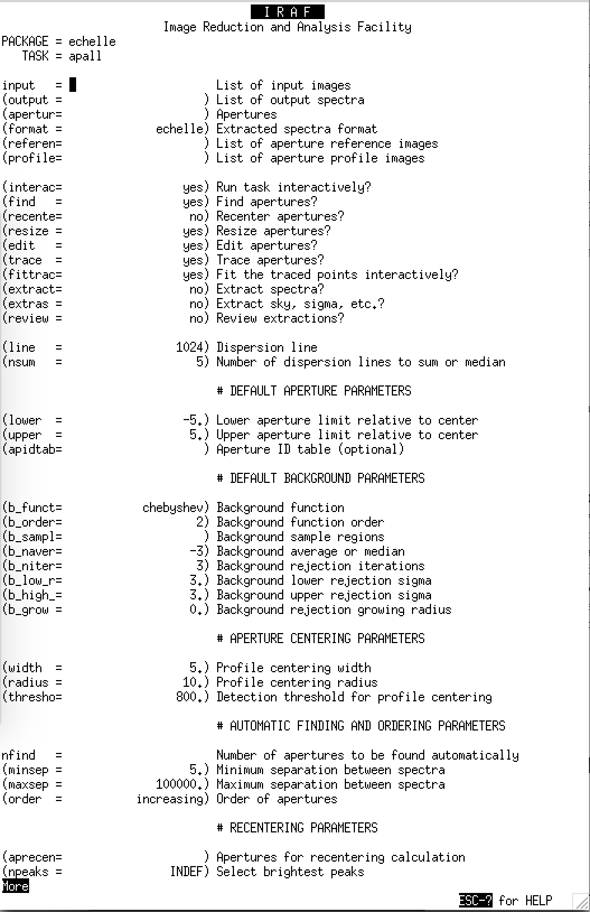
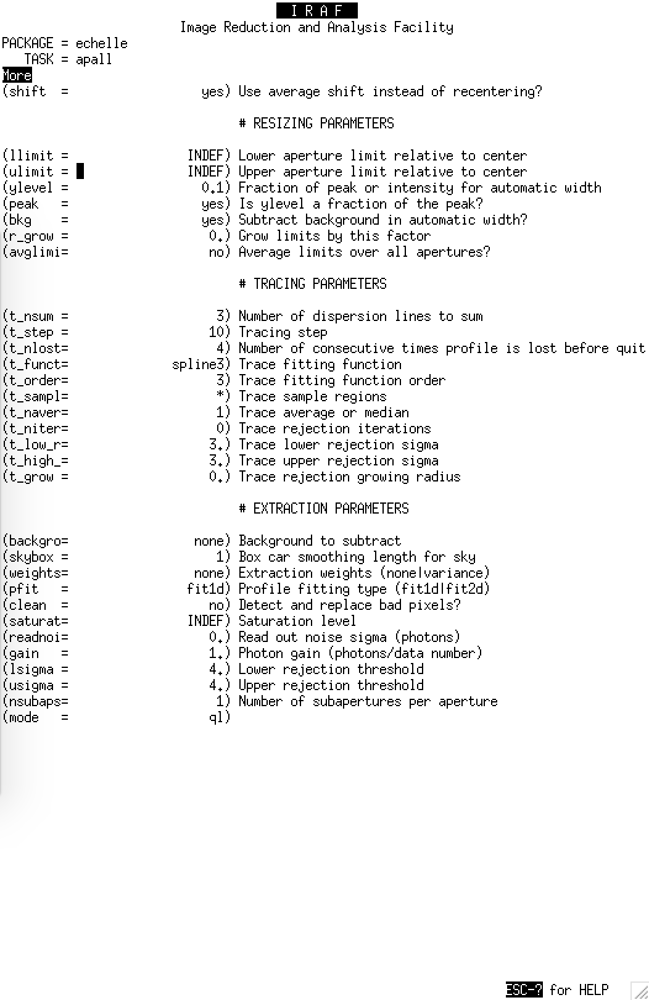
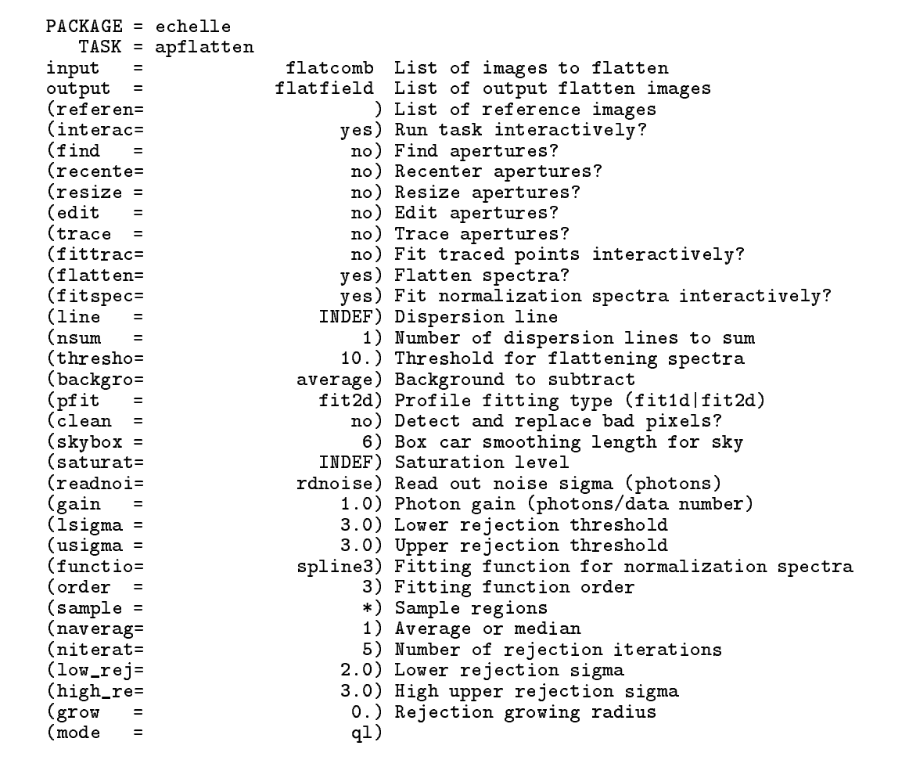

CAFE Observations Preparation
-----------------------------

Code to prepare for CAFE observations

CAFE-SNR.py estimates the required exposure times and total
observing time including overheads for obvservations with the
CAFE spectrogrpah at Calar Alto, Spain.

mkfinders.py makes 3' by 3' finding charts (N up, E left)
using pyds9 - this should be replaced with Paul's new gnerator

CAFE Data Reduction - *WORK IN PROGRESS*
----------------------------------------

parseCafeHeaders.py - a script to check what targets have been observed

parseCafeSkyApertures.py - a script to analyse manually placed sky apertures for automating the procedure

ristretto.py - my attempt at automating the extraction of echelle spectra - based heavily on my long-slit code Spector.py

Screendumps of Reduction Steps
-------------------------------

Contributors
------------

James McCormac
